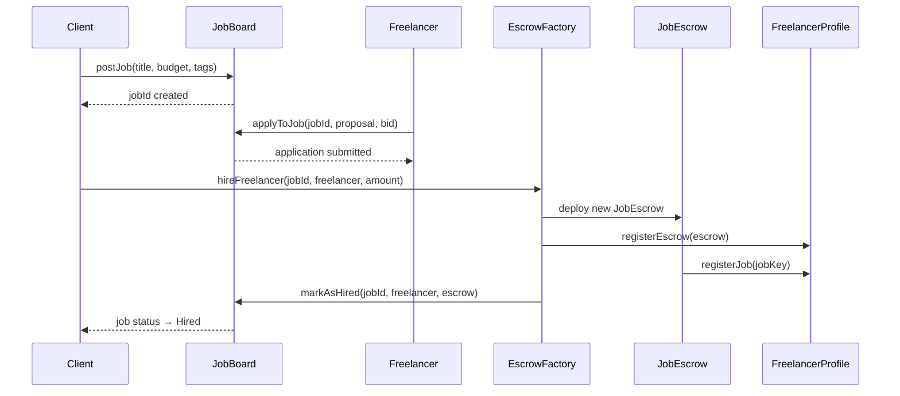
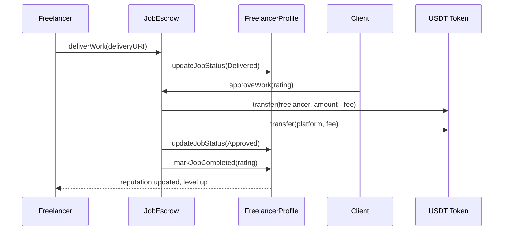

# 🚀 Web3 Freelancing Platform - Final Year Project (FYP)

A decentralized freelancing and startup funding platform built on blockchain technology, enabling secure escrow-based job management, on-chain reputation systems, and tokenized startup investments.

---

## 📋 Table of Contents

- [Overview](#overview)
- [Key Features](#key-features)
- [Architecture](#architecture)
- [Smart Contracts](#smart-contracts)
- [Technology Stack](#technology-stack)
- [Project Structure](#project-structure)
- [Getting Started](#getting-started)
- [User Roles](#user-roles)
- [Core Workflows](#core-workflows)
- [Gas Cost Management](#gas-cost-management)
- [Environment Variables](#environment-variables)
- [Scripts](#scripts)
- [Contributing](#contributing)
- [License](#license)

---

## 🎯 Overview

This platform revolutionizes the gig economy by leveraging blockchain technology to provide:

- **Trustless Escrow**: Smart contract-based payment protection for both clients and freelancers
- **On-Chain Reputation**: Immutable, verifiable track records and credential verification
- **Decentralized Job Board**: Post, apply, and manage jobs entirely on-chain
- **Startup Tokenization**: Founders can tokenize equity and attract blockchain-native investors
- **Multi-Role Support**: Freelancers, Clients, Founders, Investors, and Admins
- **AI Assistant**: Built-in AI to help users navigate the platform and make informed decisions

---

## ✨ Key Features

### For Freelancers
- ✅ Create on-chain profiles with KYC verification
- ✅ Build immutable reputation through completed jobs
- ✅ Secure USDT payments via smart contract escrow
- ✅ Level progression system (0-5) based on completed jobs and ratings
- ✅ Portfolio services with pricing and media
- ✅ Apply to jobs with custom proposals and bids

### For Clients/Founders
- ✅ Post jobs with budgets, tags, and expiration dates
- ✅ Review freelancer applications with on-chain credentials
- ✅ Escrow-protected payments with dispute resolution
- ✅ Track job progress through lifecycle states
- ✅ Anti-spam measures (optional bond or KYC-gated posting)

### For Investors
- ✅ Discover tokenized startups
- ✅ Review founder credentials and project escrows
- ✅ Transparent on-chain investment tracking
- ✅ Built-in analytics and AI-powered insights

### Platform Features
- 🔐 **Web3 Authentication**: Email, Google, or wallet-based login via thirdweb
- 🎨 **Modern UI**: Dark mode, glassmorphism effects, responsive design
- 💰 **Gas Sponsorship**: Optional gasless transactions for better UX
- 🤖 **AI Integration**: Intelligent assistant for project matching and analysis
- 📊 **Analytics Dashboard**: Real-time metrics for all user roles
- ⚡ **IPFS Integration**: Decentralized storage for profiles, deliverables, and metadata

---

## 🏗️ Architecture

### Blockchain Layer
```
┌─────────────────────────────────────────────────────────────┐
│                      Smart Contracts                        │
├─────────────────────────────────────────────────────────────┤
│                                                             │
│  JobBoard              FreelancerProfile     ClientProfile  │
│  ├─ Post Jobs          ├─ Reputation        ├─ Client Info │
│  ├─ Applications       ├─ KYC Status        └─ Jobs Posted │
│  ├─ Job Lifecycle      ├─ Services                          │
│  └─ Tags & Search      └─ Multi-job Support                 │
│                                                             │
│  JobEscrow             EscrowFactory     FreelancerFactory  │
│  ├─ USDT Lock          ├─ Deploy Escrow  ├─ Create Profile │
│  ├─ Milestones         ├─ Link Profile   └─ KYC Manage     │
│  ├─ Dispute Mgmt       └─ Job Tracking                      │
│  └─ Auto-approve                                            │
│                                                             │
│  TestUSDT (Testnet Only)                                    │
│  └─ Mock USDT for testing                                   │
└─────────────────────────────────────────────────────────────┘
```

### Frontend Layer
```
┌─────────────────────────────────────────────────────────────┐
│                     Next.js Application                     │
├─────────────────────────────────────────────────────────────┤
│                                                             │
│  Landing Page          Multi-Role Dashboard                 │
│  ├─ Hero Section       ├─ Freelancer Dashboard             │
│  ├─ Features           ├─ Client Dashboard                 │
│  ├─ Role Selection     ├─ Founder Dashboard                │
│  └─ Authentication     ├─ Investor Dashboard                │
│                        └─ Admin Dashboard                   │
│                                                             │
│  Components            Utils & Hooks                        │
│  ├─ Auth (Login)       ├─ Thirdweb Client                  │
│  ├─ Job Management     ├─ IPFS Upload (Pinata)             │
│  ├─ Profile Forms      ├─ Contract Interactions            │
│  └─ UI Library         └─ Toast Notifications              │
└─────────────────────────────────────────────────────────────┘
```

---

## 📜 Smart Contracts

### 1. **JobBoard.sol** (704 lines)
Central job marketplace contract with application system.

**Key Features:**
- Post, update, cancel, and reopen jobs
- Freelancer applications with proposals and custom bids
- Job lifecycle: `Open → Hired → Completed` or `Open → Expired/Cancelled`
- Anti-spam modes: `None`, `BondRequired`, `OnlyKYC`
- Tag-based search (max 5 tags per job)
- Pagination support for large datasets
- Factory integration for escrow creation

**Main Functions:**
- `postJob()` - Create a new job listing
- `applyToJob()` - Submit application with proposal
- `markAsHired()` - Factory callback when escrow created
- `markAsCompleted()` - Factory callback on job completion
- `cancelJob()` - Cancel open jobs
- `closeExpired()` - Auto-close expired listings

### 2. **FreelancerProfile.sol** (341 lines)
Per-freelancer profile with reputation and multi-job support.

**Key Features:**
- On-chain profile (name, bio, IPFS URI)
- KYC verification (factory-controlled)
- Reputation system: `totalPoints` (sum of ratings), `completedJobs`, `level` (0-5)
- Multi-job tracking with status state machine
- Active escrow registry
- Service offerings (up to 100 services)

**Reputation System:**
```
Level 0: Start (0 jobs)
Level 1: 5 jobs & 20 points
Level 2: 10 jobs & 45 points
Level 3: 15 jobs & 70 points
Level 4: 20 jobs & 95 points
Level 5: 25 jobs & 120 points
```

**Job States:**
```
None → Created → InProgress → Delivered → Approved → Completed
                    ↓            ↓          ↓
                Cancelled ← Disputed → (Resolution)
```

### 3. **JobEscrow.sol** (367 lines)
Single-use escrow contract for client↔freelancer jobs.

**Key Features:**
- USDT-based payment locking
- Immutable parties (client, freelancer)
- Platform fee (configurable BPS)
- Multi-milestone support (via deliverWork)
- Dispute resolution with partial payouts
- Auto-approval after review window
- Mutual cancellation support

**Lifecycle:**
1. Factory creates and funds escrow
2. `bootstrapRegisterJob()` - Links to FreelancerProfile
3. Freelancer calls `deliverWork()`
4. Client calls `approveWork(rating)` OR dispute raised
5. Resolver settles disputes with `resolveDispute()`
6. Auto-approve via `processTimeouts()` if client silent

### 4. **EscrowFactory.sol** (7,691 bytes)
Deploys and manages JobEscrow contracts, links to JobBoard.

**Features:**
- Deploy escrow with USDT funding
- Link to FreelancerProfile
- Update JobBoard status on completion
- Configurable timelines (cancel window, delivery deadline, review window)

### 5. **FreelancerFactory.sol** (8,329 bytes)
Deploys FreelancerProfile contracts, manages KYC.

**Features:**
- One profile per freelancer
- KYC verification control
- Profile registry and lookup

### 6. **ClientProfile.sol** & **ClientFactory.sol**
Similar pattern to FreelancerProfile for client metadata.

### 7. **TestUSDT.sol** (348 bytes)
Simple ERC20 for testing. **Only use on testnets!**

---

## 🛠️ Technology Stack

### Blockchain
- **Solidity**: `^0.8.28`
- **OpenZeppelin Contracts**: Security standards (ReentrancyGuard, SafeERC20)
- **Ethereum/Polygon**: EVM-compatible chains
- **Thirdweb SDK**: v5 for Web3 interactions

### Frontend
- **Framework**: Next.js 16.0.0 (React 19.2.0)
- **Language**: TypeScript 5
- **Styling**: Tailwind CSS 4.1.9 + CSS Animate
- **UI Components**: Radix UI + shadcn/ui
- **Animations**: Framer Motion
- **Forms**: React Hook Form + Zod validation
- **Charts**: Recharts
- **Icons**: Lucide React

### Web3 Integration
- **thirdweb**: v5 SDK for wallet, contracts, and auth
- **ethers.js**: v5.8.0 for low-level contract calls
- **viem**: v2.38.5 for modern Web3 utilities

### Storage & APIs
- **IPFS**: Pinata SDK for decentralized storage
- **APIs**: Next.js API routes

### Developer Tools
- **TypeScript**: Strict mode enabled
- **ESNext**: Modern JavaScript features
- **PostCSS**: CSS processing
- **Webpack**: Custom build config

---

## 📁 Project Structure

```
Dapp/
├── app/                          # Next.js 13+ App Router
│   ├── admin/                    # Admin dashboard pages
│   ├── api/                      # API routes (IPFS upload, etc.)
│   ├── client/                   # Client-specific pages
│   ├── founder/                  # Founder dashboard
│   ├── freelancer/               # Freelancer dashboard
│   ├── investor/                 # Investor dashboard
│   ├── globals.css               # Global styles + Tailwind
│   ├── layout.tsx                # Root layout (providers)
│   └── page.tsx                  # Landing page
│
├── components/                   # React components
│   ├── admin/                    # Admin components
│   ├── auth/                     # Login modal, auth flows
│   ├── client/                   # Client dashboard components
│   ├── dashboard/                # Multi-role dashboard
│   ├── freelancer/               # Freelancer components
│   ├── landing/                  # Landing page sections
│   ├── ui/                       # Reusable UI (shadcn/ui)
│   ├── theme-provider.tsx        # Dark/light theme context
│   └── theme-toggle.tsx          # Theme switcher
│
├── contracts/                    # Solidity smart contracts
│   ├── JobBoard.sol              # Job marketplace
│   ├── JobEscrow.sol             # Escrow logic
│   ├── FreelancerProfile.sol     # Freelancer reputation
│   ├── FreelancerFactory.sol     # Profile factory
│   ├── ClientProfile.sol         # Client metadata
│   ├── ClientFactory.sol         # Client factory
│   ├── EscrowFactory.sol         # Escrow deployer
│   └── TestUSDT.sol              # Mock USDT (testnet)
│
├── artifacts/                    # Compiled contract ABIs & bytecode
│
├── constants/                    # Contract addresses & ABIs
│   ├── deployedContracts.json    # Deployed addresses
│   └── deployedContracts.ts      # TypeScript exports
│
├── hooks/                        # Custom React hooks
│   ├── use-mobile.ts             # Mobile detection
│   ├── use-toast.ts              # Toast notifications
│   └── useIPFSUpload.ts          # IPFS upload hook
│
├── lib/                          # Utility libraries
│   ├── chains.ts                 # Blockchain config
│   ├── thirdweb-client.ts        # Thirdweb client setup
│   ├── thirdweb.ts               # Thirdweb helpers
│   └── utils.ts                  # General utilities
│
├── public/                       # Static assets
│
├── scripts/                      # Helper scripts
│   └── error-selectors.js        # Error debugging
│
├── styles/                       # Additional styles
│
├── utils/                        # Frontend utilities
│
├── .gitignore                    # Git ignore rules
├── components.json               # shadcn/ui config
├── GAS_COST_OPTIONS.md          # Gas optimization guide
├── next.config.mjs               # Next.js config
├── package.json                  # Dependencies
├── postcss.config.mjs            # PostCSS config
├── tsconfig.json                 # TypeScript config
└── README.md                     # This file
```

---

## 🚀 Getting Started

### Prerequisites
- **Node.js**: v18+ recommended
- **npm** or **pnpm**
- **Wallet**: MetaMask or any Web3 wallet
- **Testnet funds**: For Polygon Amoy or your chosen testnet

### Installation

1. **Clone the repository**
```bash
git clone <repository-url>
cd Dapp
```

2. **Install dependencies**
```bash
npm install
# or
pnpm install
```

3. **Set up environment variables**

Create a `.env.local` file in the root directory:

```bash
# Thirdweb
NEXT_PUBLIC_THIRDWEB_CLIENT_ID=your_thirdweb_client_id

# IPFS (Pinata)
NEXT_PUBLIC_PINATA_JWT=your_pinata_jwt
PINATA_API_KEY=your_pinata_api_key
PINATA_SECRET_API_KEY=your_pinata_secret

# Blockchain
NEXT_PUBLIC_CHAIN_ID=80002  # Polygon Amoy testnet
NEXT_PUBLIC_RPC_URL=your_rpc_url

# Contract Addresses (update after deployment)
NEXT_PUBLIC_JOB_BOARD_ADDRESS=0x...
NEXT_PUBLIC_FREELANCER_FACTORY_ADDRESS=0x...
NEXT_PUBLIC_CLIENT_FACTORY_ADDRESS=0x...
NEXT_PUBLIC_ESCROW_FACTORY_ADDRESS=0x...
NEXT_PUBLIC_USDT_ADDRESS=0x...
```

4. **Update contract addresses**

Edit `constants/deployedContracts.ts` with your deployed contract addresses.

5. **Run development server**
```bash
npm run dev
```

Open [http://localhost:3000](http://localhost:3000) in your browser.

### Deployment

**Build for production:**
```bash
npm run build
npm start
```

**Deploy contracts:**
Use thirdweb CLI, Hardhat, or Remix to deploy contracts to your target network. Update addresses in `constants/deployedContracts.ts`.

---

## 👥 User Roles

### 1. **Freelancer**
- Create verified profile with KYC
- Browse and apply to jobs
- Build on-chain reputation (levels 0-5)
- Deliver work and receive USDT payments
- Manage service offerings

### 2. **Client/Founder**
- Post jobs with budgets and requirements
- Review freelancer applications
- Fund escrows for hired freelancers
- Approve deliverables and rate performance
- Tokenize startup equity (Founder mode)

### 3. **Investor**
- Discover tokenized startups
- Review founder track records
- Invest in projects with transparent escrows
- Track portfolio performance

### 4. **Admin**
- Manage platform settings
- Approve KYC verifications
- Resolve disputes
- Monitor analytics

---

## 🔄 Core Workflows

### Job Posting & Hiring Flow


### Work Delivery & Payment Flow


---

## ⚡ Gas Cost Management

See [`GAS_COST_OPTIONS.md`](./GAS_COST_OPTIONS.md) for detailed strategies on managing gas costs, including:

- ✅ Skip transactions if profile unchanged
- Rate limiting updates
- Optional user-paid updates
- Platform fee options
- IPNS for stable URIs

**Current Implementation:**
- Profile updates check for changes before submitting transactions
- Gas sponsorship via thirdweb for better UX (configurable)

---

## 🔐 Environment Variables

| Variable | Description | Required |
|----------|-------------|----------|
| `NEXT_PUBLIC_THIRDWEB_CLIENT_ID` | Thirdweb client ID | ✅ |
| `NEXT_PUBLIC_PINATA_JWT` | Pinata JWT for IPFS uploads | ✅ |
| `PINATA_API_KEY` | Pinata API key | ✅ |
| `PINATA_SECRET_API_KEY` | Pinata secret key | ✅ |
| `NEXT_PUBLIC_CHAIN_ID` | Blockchain network ID (e.g., 80002 for Polygon Amoy) | ✅ |
| `NEXT_PUBLIC_RPC_URL` | Custom RPC endpoint | Optional |
| `NEXT_PUBLIC_JOB_BOARD_ADDRESS` | Deployed JobBoard address | ✅ |
| `NEXT_PUBLIC_FREELANCER_FACTORY_ADDRESS` | FreelancerFactory address | ✅ |
| `NEXT_PUBLIC_CLIENT_FACTORY_ADDRESS` | ClientFactory address | ✅ |
| `NEXT_PUBLIC_ESCROW_FACTORY_ADDRESS` | EscrowFactory address | ✅ |
| `NEXT_PUBLIC_USDT_ADDRESS` | USDT token address (or TestUSDT) | ✅ |

---

## 📜 Scripts

| Command | Description |
|---------|-------------|
| `npm run dev` | Start development server (port 3000) |
| `npm run build` | Build production bundle |
| `npm start` | Start production server |
| `npm run lint` | Run ESLint (if configured) |

**Utility Scripts:**
- `scripts/error-selectors.js` - Extract custom error selectors from contracts

---

## 🤝 Contributing

This is a Final Year Project (FYP). If you'd like to contribute or provide feedback:

1. Fork the repository
2. Create a feature branch (`git checkout -b feature/AmazingFeature`)
3. Commit your changes (`git commit -m 'Add some AmazingFeature'`)
4. Push to the branch (`git push origin feature/AmazingFeature`)
5. Open a Pull Request

---

## 📄 License

This project is for educational purposes (Final Year Project). Please check with the repository owner for licensing terms.

---

## 🙏 Acknowledgments

- **Thirdweb** - Web3 SDK and infrastructure
- **OpenZeppelin** - Secure smart contract libraries
- **Pinata** - IPFS storage
- **shadcn/ui** - Beautiful UI components
- **Next.js** - React framework
- **Radix UI** - Accessible component primitives

---

## 📞 Support

For issues, questions, or suggestions:
- Open an issue on GitHub
- Contact the development team
EMAIL: geassalgorithm@gmail.com
---

## 🗺️ Roadmap

- [ ] Mainnet deployment
- [ ] Multi-token support (ETH, DAI, etc.)
- [ ] Enhanced AI features
- [ ] Mobile app (React Native)
- [ ] Advanced analytics dashboard
- [ ] Reputation NFTs
- [ ] DAO governance for platform decisions

---

**Built with ❤️ as a Final Year Project**
